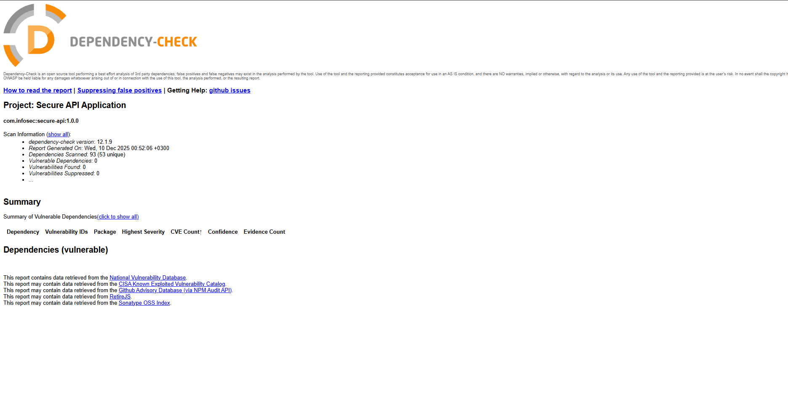
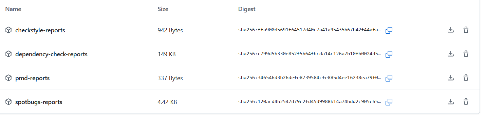

# Безопасное веб-приложение API

Безопасное REST API приложение на Spring Boot с JWT аутентификацией, базой данных PostgreSQL и защитой от распространенных уязвимостей безопасности.

## Возможности

- **JWT аутентификация**: Безопасная токен-based аутентификация
- **Хеширование паролей**: Шифрование паролей с помощью BCrypt
- **Защита от SQL-инъекций**: Параметризованные запросы через Spring Data JPA
- **Защита от XSS**: Санитизация всех пользовательских данных
- **База данных PostgreSQL**: Постоянное хранение данных

## API Endpoints

### 1. POST /auth/login
Аутентифицирует пользователя и возвращает JWT токен.

**Тело запроса:**
```json
{
  "username": "user123",
  "password": "password123"
}
```

**Ответ:**
```json
{
  "token": "eyJhbGciOiJIUzI1NiIsInR5cCI6IkpXVCJ9...",
  "type": "Bearer",
  "username": "user123"
}
```

### 2. GET /api/data
Возвращает список пользователей. Требуется аутентификация.

**Заголовки:**
```
Authorization: Bearer <token>
```

**Ответ:**
```json
{
  "message": "List of users retrieved successfully",
  "users": [
    {
      "id": 1,
      "username": "user123",
      "email": "user@example.com",
      "fullName": "John Doe"
    }
  ],
  "totalCount": 1
}
```

### 3. GET /users/{id}
Возвращает конкретного пользователя по ID. Требуется аутентификация.

**Заголовки:**
```
Authorization: Bearer <token>
```

**Ответ:**
```json
{
  "id": 1,
  "username": "user123",
  "email": "user@example.com",
  "fullName": "John Doe"
}
```

## Функции безопасности

### Защита от SQL-инъекций
- Все запросы к базе данных используют Spring Data JPA с параметризованными запросами
- Отсутствует конкатенация строк для SQL запросов
- Подготовленные выражения (prepared statements) используются автоматически

### Защита от XSS
- Все пользовательские данные санитизируются с помощью Apache Commons Text
- HTML сущности экранируются в ответах
- JSON ответы санитизируются

### Безопасность аутентификации
- Пароли хешируются с использованием BCrypt
- JWT токены используются для stateless аутентификации
- Токены истекают через 24 часа (настраивается)
- Защищенные endpoints требуют валидный JWT токен

## Инструкции по настройке

### Предварительные требования
- Java 17 или выше
- Maven 3.6+
- PostgreSQL 12+

### Настройка базы данных
1. Создайте базу данных PostgreSQL:
```sql
CREATE DATABASE infosec_db;
```

2. Обновите `src/main/resources/application.properties` вашими учетными данными базы данных:
```properties
spring.datasource.url=jdbc:postgresql://localhost:5432/infosec_db
spring.datasource.username=your_username
spring.datasource.password=your_password
```

### Запуск приложения
1. Соберите проект:
```bash
mvn clean install
```

2. Запустите приложение:
```bash
mvn spring-boot:run
```

API будет доступно по адресу `http://localhost:8080`

## Тестирование API

### 1. Создайте тестового пользователя (можете использовать клиент базы данных или добавить инициализатор данных)

### 2. Войдите, чтобы получить токен:
```bash
curl -X POST http://localhost:8080/auth/login \
  -H "Content-Type: application/json" \
  -d '{"username":"testuser","password":"testpass"}'
```

### 3. Используйте токен для доступа к защищенным endpoints:
```bash
curl -X GET http://localhost:8080/api/data \
  -H "Authorization: Bearer <your_token>"
```

```bash
curl -X GET http://localhost:8080/users/1 \
  -H "Authorization: Bearer <your_token>"
```

## Структура проекта

```
src/
├── main/
│   ├── java/com/infosec/
│   │   ├── controller/     # REST контроллеры
│   │   ├── service/        # Бизнес-логика
│   │   ├── repository/     # Слой доступа к данным
│   │   ├── entity/         # JPA сущности
│   │   ├── dto/            # Объекты передачи данных
│   │   ├── security/       # Конфигурация безопасности
│   │   ├── util/           # Утилитные классы (JWT, XSS)
│   │   └── exception/      # Обработчики исключений
│   └── resources/
│       └── application.properties
└── pom.xml
```

## Конфигурация

Основные параметры конфигурации в `application.properties`:
- `jwt.secret`: Секретный ключ для подписи JWT (измените в production!)
- `jwt.expiration`: Время истечения токена в миллисекундах (по умолчанию: 86400000 = 24 часа)
- Настройки подключения к базе данных

## Реализованные лучшие практики безопасности

1. ✅ Параметризованные запросы (защита от SQL-инъекций)
2. ✅ Санитизация входных данных (защита от XSS)
3. ✅ Хеширование паролей с помощью BCrypt
4. ✅ Аутентификация на основе JWT токенов
5. ✅ Защищенные endpoints требуют аутентификации
6. ✅ Stateless управление сессиями
## Скриншоты отчетов SAST/SCA из раздела "Actions"

